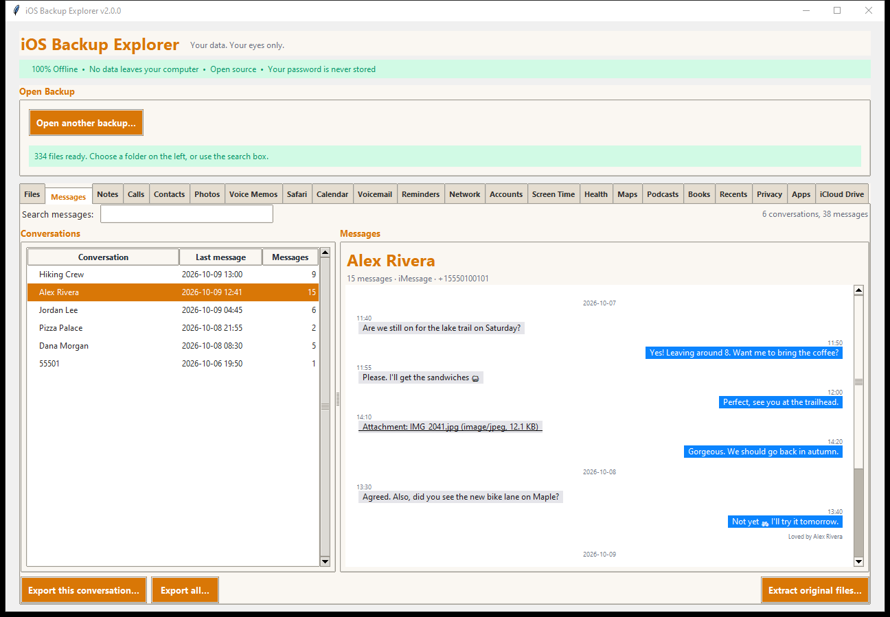
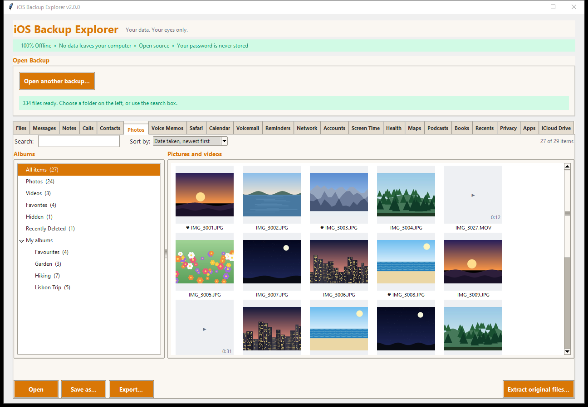
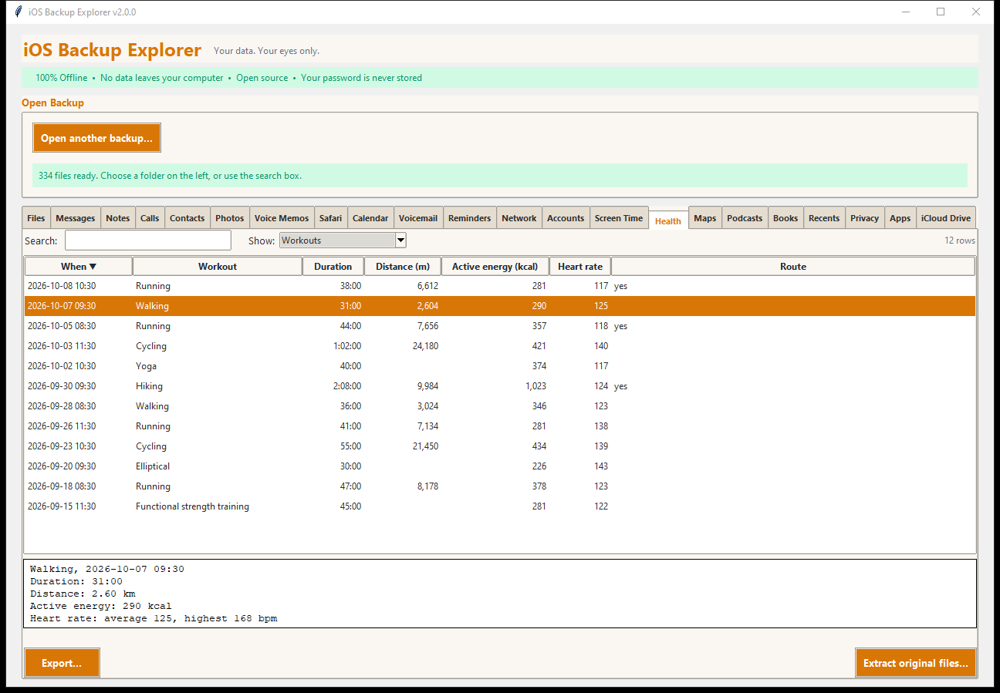
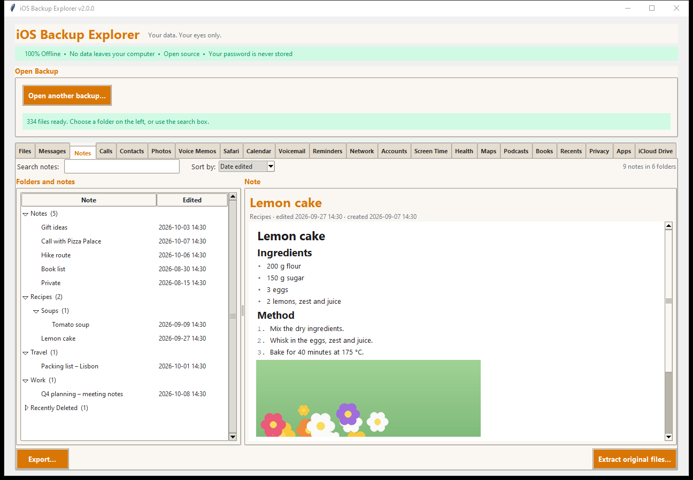
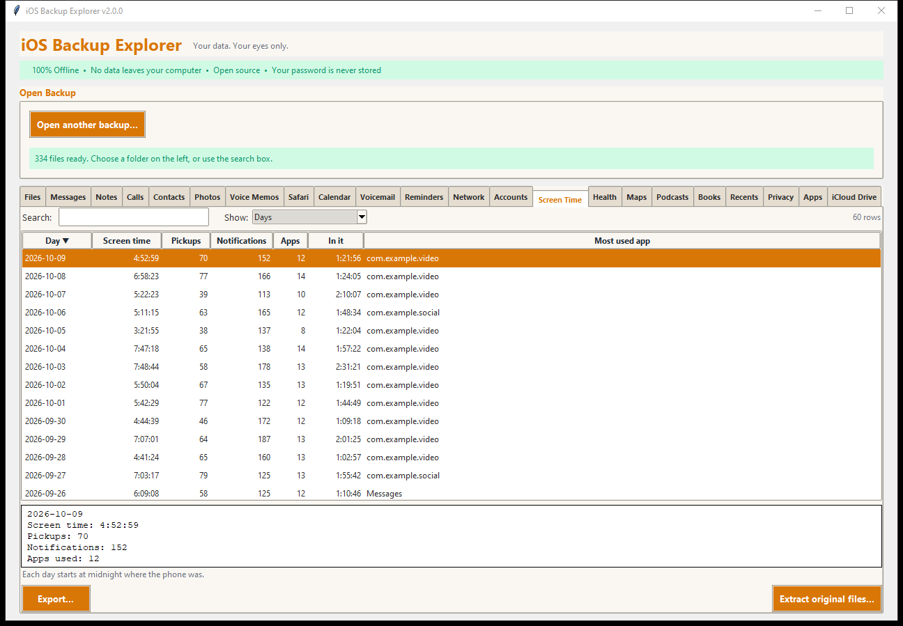
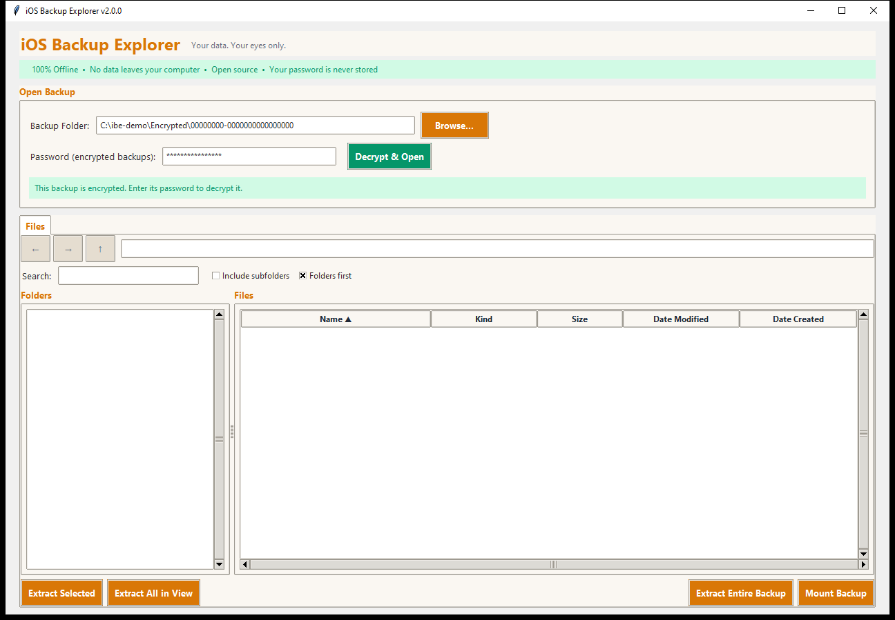

<h1 align="center">iOS Backup Explorer</h1>

<p align="center">
  <strong>Your data. Your eyes only.</strong><br>
  A free, open-source app to open, browse and extract iPhone and iPad backups, encrypted or not, and to read them app by app: messages, notes, photos, health and more.
</p>

<p align="center">
  
  <a href="#installation"></a>
  <a href="LICENSE"></a>
  <a href="#security--privacy"></a>
  <a href="#security--privacy"></a>
  
</p>

<p align="center">
  <br>
  <sub>Every picture here is the program running on an <em>invented</em> demo backup; nothing in it is a real person's data.</sub>
</p>

> **iOS Backup Explorer is a hard fork of [BackupLens](https://github.com/mrgunes/BackupLens)**
> by [Eyyup (Eric) Gunes](https://github.com/mrgunes), originally released under the MIT License.
> The original author's copyright is preserved in [LICENSE-MIT](LICENSE-MIT) and [NOTICE](NOTICE).
> This fork is licensed under [AGPL-3.0-or-later](LICENSE). Version 2.0.0 is its first release as a
> project of its own; see the [changelog](CHANGELOG.md).

---

## Why iOS Backup Explorer?

You made an encrypted iPhone backup with iTunes, Finder, or the Apple Devices app. Now you need to get your photos, messages, or health data out of it. You search online and find tools that:

- Cost $30–$80 for a license
- Upload your data to unknown servers
- Are closed source — you have no idea what they do with your passwords
- Haven't been updated since 2019

**iOS Backup Explorer is different.**

| | iOS Backup Explorer | Paid alternatives |
|---|---|---|
| **Price** | Free forever | $30–$80 |
| **Open source** | Yes — read every line | No |
| **Network access** | None. Zero. Offline only. | Often phones home |
| **Your password** | Never stored, never sent | Who knows? |
| **Platform** | Windows, macOS, Linux | Usually one platform |

---

## What it does

- **Opens any local backup**: encrypted (with your backup password), unencrypted, or a folder that was **already decrypted and extracted**. Nothing in the backup is ever changed.
- **A real file manager** for the whole backup: folders, sorting, instant search, extraction of any file, folder or the **entire backup**, and optionally **mounting** it as a read-only drive.
- **One tab for each app**, reading the app's data the way the phone shows it, with search, details and export. A tab appears only when the backup has its data.
- **Exports in formats you can use**: text, Markdown, web pages, PDF, spreadsheets, JSON, vCard, iCalendar, GPX routes, bookmarks files, JPEG, audio with transcripts. **The original files can always be extracted untouched**, too.

### The tabs

| | | |
|---|---|---|
| **Messages**: chat bubbles, tapbacks, attachments, search | **Notes**: formatting, checklists, pictures, folders, call recordings | **Calls** and **Contacts** |
| **Photos**: a thumbnail grid with albums | **Voice Memos** | **Voicemail** with the phone's transcripts |
| **Safari**: history, bookmarks, reading list, tabs | **Calendar** and **Reminders** | **Health**: activity, workouts and routes, body measurements, sleep, Medical ID |
| **Screen Time**: days, weeks, apps, websites | **Network**: Wi-Fi, Bluetooth, data used by apps | **Accounts** and device information |
| **Maps**, **Podcasts**, **Books** | **Privacy**: app permissions and location access | **Recents**, **Apps**, **iCloud Drive** |

<table>
  <tr>
    <td width="50%"><br><sub><b>Photos</b>: thumbnails made only for what is on screen, with the phone's albums</sub></td>
    <td width="50%"><br><sub><b>Health</b>: workouts with routes (export to GPX), measurements, sleep, Medical ID</sub></td>
  </tr>
  <tr>
    <td width="50%"><br><sub><b>Notes</b>: formatting, checklists and pictures like on the phone</sub></td>
    <td width="50%"><br><sub><b>Screen Time</b>: time per day, week, app and website</sub></td>
  </tr>
</table>

More pictures are in the [documentation](docs/README.md).

---

## Installation

You need **Python 3.9 or newer** (tkinter comes with it on Windows and macOS; on Linux: `sudo apt install python3-tk`).

```bash
git clone https://github.com/slammingprogramming/iOS-backup-explorer.git
cd iOS-backup-explorer
pip install -r requirements.txt          # one small required package
# Optional: picture previews, HEIC photos, PDF export
# pip install -r requirements-optional.txt
python ios_backup_explorer.py
```

No build step, no Docker, no configuration. Details, optional extras and platform notes: [Installation](docs/INSTALL.md).

## Quick start

1. Start the program. It looks for your backups; if it finds none, **Browse...** to the device's folder (the long hex-named one inside `MobileSync/Backup`, containing `Manifest.plist`).
2. If the backup is encrypted, type its **encryption password** (the one you set in iTunes/Finder, *not* your Apple ID password) and click **Decrypt & Open**; otherwise click **Open Backup**.
3. Browse the **Files** tab, or click an app's tab. Use **Export...** to save what you see, **Extract original files...** to take the raw files.

<p align="center">
  
</p>

Full walkthrough: [Getting started](docs/GETTING_STARTED.md). Don't have a backup handy? Make the invented demo backup: `python tools/make_demo_backup.py "C:\Demo\Demo iPhone Backup"` and open that folder ([how](docs/SCREENSHOTS.md)).

---

## Documentation

| | |
|---|---|
| [Installation](docs/INSTALL.md) · [Getting started](docs/GETTING_STARTED.md) · [The file browser](docs/FILE_BROWSER.md) | Using the program |
| [The app tabs](docs/apps/README.md) | One page per group of tabs |
| [Exporting](docs/EXPORTING.md) · [Where the data comes from](docs/DATA_SOURCES.md) · [Health data](docs/HEALTH.md) | Reference |
| [FAQ](docs/FAQ.md) · [Troubleshooting](docs/TROUBLESHOOTING.md) · [Glossary](docs/GLOSSARY.md) · [How a backup is built](docs/HOW_BACKUPS_WORK.md) | Help and background |
| [Contributing](CONTRIBUTING.md) · [Architecture](docs/ARCHITECTURE.md) · [Development](docs/DEVELOPMENT.md) · [Testing](docs/TESTING.md) · [Versioning](docs/VERSIONING.md) | Working on it |
| [Changelog](CHANGELOG.md) · [Security policy](SECURITY.md) | Project |

---

## What is checked, and what is not (yet)

Honesty matters when you are reading someone's data:

- Every tab has automated tests on **invented** data, and the readers were **mutation-checked** (the code is broken on purpose to prove the tests notice).
- Most tabs were also checked against a **real backup**: their counts and values were compared with the raw databases. **Maps, Podcasts, Books, Photos and Voice Memos** were written from the apps' database layouts, because the backup used had no data for them, so they are tested on generated data only. [Where the data comes from](docs/DATA_SOURCES.md) lists the status of each tab.
- **Health** is read reliably where it can be proved, and the rest is listed openly as not yet covered: kinds of data the database does not name, values whose unit was not verified, sleep summed per night, medications, ECG and more. **Why, and what is needed to close each gap, is in [Health data](docs/HEALTH.md).**
- A backup holds only what the phone kept: iCloud-only photos and messages, passwords (the keychain) and locked notes are not readable. See the [FAQ](docs/FAQ.md).

---

## Security & Privacy

> **iPhone backups contain your most sensitive data — photos, messages, health records, passwords, financial apps, and more. You should be extremely careful about which tools you trust with this data.**

### Our security promises:

1. **100% Offline** — iOS Backup Explorer makes zero network connections. Disconnect your internet and it works identically. [Verify it yourself.](#verify-it-yourself)

2. **Your password is never stored** — It's held in memory only while the app runs. When you close iOS Backup Explorer, it's gone.

3. **No telemetry, no analytics, no tracking** — We don't know you exist. We don't want to.

4. **Fully auditable** — The app is plain Python (about 17,000 lines in 70 files, with no build step): the app itself, the file browser, the file index, and a reader and a view for each app. Read them. We encourage it.

5. **Open source dependencies** — Our only required dependency ([iphone_backup_decrypt](https://github.com/jsharkey13/iphone_backup_decrypt)) is also open source and MIT licensed.

6. **Read-only** — Backups are never modified; unencrypted and extracted backups are opened read-only. What the program writes (exports, extractions, private temporary working copies it deletes when you close the backup) is described in [SECURITY.md](SECURITY.md).

---

## Where are my backups?

### Windows

1. Press `Win + R`, type `%APPDATA%\Apple Computer\MobileSync\Backup`, press Enter (or `%USERPROFILE%\Apple\MobileSync\Backup` if you installed iTunes from the Microsoft Store or use the Apple Devices app)
2. Each subfolder (long alphanumeric name) is one device backup

### macOS

1. Open Finder, press `Cmd + Shift + G`
2. Paste: `~/Library/Application Support/MobileSync/Backup/`
3. Each subfolder is one device backup

### How to create an encrypted backup

1. Connect your iPhone/iPad to your computer
2. Open **iTunes** (Windows), **Finder** (macOS) or the **Apple Devices** app
3. Select your device and tick **"Encrypt local backup"**
4. Set a password — **remember this password!**
5. Click **Back Up Now**

(An encrypted backup holds more than an unencrypted one: Health data, for example.)

---

## FAQ

The full list is in the [FAQ](docs/FAQ.md). A few of the most asked:

<details>
<summary><strong>Can it crack or bypass my backup password?</strong></summary>

No. It needs the correct encryption password. It cannot guess, crack or bypass passwords, which also means no one else can read your backup without it. A forgotten password cannot be recovered (see the FAQ for what you can try).
</details>

<details>
<summary><strong>Does it work with iCloud backups?</strong></summary>

No. Only **local** backups made by iTunes, Finder or the Apple Devices app. iCloud backups live on Apple's servers.
</details>

<details>
<summary><strong>Why is something missing?</strong></summary>

A backup holds what was on the phone when it was made: iCloud-only data, unencrypted-backup omissions and password-locked notes are not there, and the apps' layouts change between iOS versions. See [Troubleshooting](docs/TROUBLESHOOTING.md#a-tab-is-missing). If something that is in your backup does not show, please report it, without sending your data.
</details>

<details>
<summary><strong>What iOS versions are supported?</strong></summary>

Encrypted backups from **iOS 13 and newer** (including iOS 17 and 18); unencrypted backups with the `Manifest.db` layout (iOS 10 and newer). Details in [Where the data comes from](docs/DATA_SOURCES.md#ios-versions).
</details>

---

## Contributing

Contributions are welcome, and the rules are short: **no network access**, **keep it auditable**, **never put real data anywhere** (tests use invented data), and **never remove the original author's credit**. See [CONTRIBUTING.md](CONTRIBUTING.md), the [development guide](docs/DEVELOPMENT.md) and [Testing](docs/TESTING.md). Releases follow [Semantic Versioning](docs/VERSIONING.md).

---

## Verify It Yourself

Don't trust us? Good. Here's how to confirm iOS Backup Explorer makes zero network connections:

```bash
# Option 1: Disconnect from the internet and run the app — it works identically.

# Option 2: Monitor network activity (macOS)
sudo lsof -i -P | grep python

# Option 3: Monitor network activity (Windows PowerShell)
Get-NetTCPConnection | Where-Object { $_.OwningProcess -eq (Get-Process python).Id }

# Option 4: Read the source — it's plain Python, and the app contains no networking code.
```

---

## Acknowledgements

iOS Backup Explorer is a hard fork of [BackupLens](https://github.com/mrgunes/BackupLens), created by
[Eyyup (Eric) Gunes](https://github.com/mrgunes). The application design, user interface, documentation
and original code are his work, and this project would not exist without it. See [AUTHORS](AUTHORS)
and [NOTICE](NOTICE).

Several features here were inspired by open pull requests and issues on the original project, and are credited to the people behind them:

- [Nikhil-42](https://github.com/Nikhil-42), whose pull requests [#1](https://github.com/mrgunes/BackupLens/pull/1) and [#2](https://github.com/mrgunes/BackupLens/pull/2) proposed unencrypted-backup support, extracting the entire backup, and mounting a backup as a file system
- [jakubstetz](https://github.com/jakubstetz), whose pull request [#5](https://github.com/mrgunes/BackupLens/pull/5) found and fixed the same extraction, threading and macOS startup bugs
- [heebeejeebees](https://github.com/heebeejeebees), who asked for unencrypted-backup support in [issue #4](https://github.com/mrgunes/BackupLens/issues/4)

iOS Backup Explorer is built on top of the excellent [iphone_backup_decrypt](https://github.com/jsharkey13/iphone_backup_decrypt) library by James Sharkey. Thank you for making encrypted backup decryption accessible to everyone.

---

## License

iOS Backup Explorer is free software, licensed under the
[GNU Affero General Public License, version 3 or (at your option) any later version](LICENSE)
(AGPL-3.0-or-later). You may use, modify and share it, provided derivative works stay under the same license
and source is made available to their users.

The original BackupLens code is Copyright (c) 2026 Eyyup (Eric) Gunes and was released under the
[MIT License](LICENSE-MIT), whose notice is preserved and must remain with this software.
See [NOTICE](NOTICE) for details.

---

<p align="center">
  <strong>Originally created as BackupLens by <a href="https://github.com/mrgunes">Eyyup (Eric) Gunes</a></strong><br>
  <sub>Because your data should be yours — no subscriptions, no surveillance.</sub><br><br>
  Maintained by <a href="https://github.com/slammingprogramming">slammingprogramming</a> and contributors.<br>
  Please also star the <a href="https://github.com/mrgunes/BackupLens">original BackupLens</a> project.
</p>
