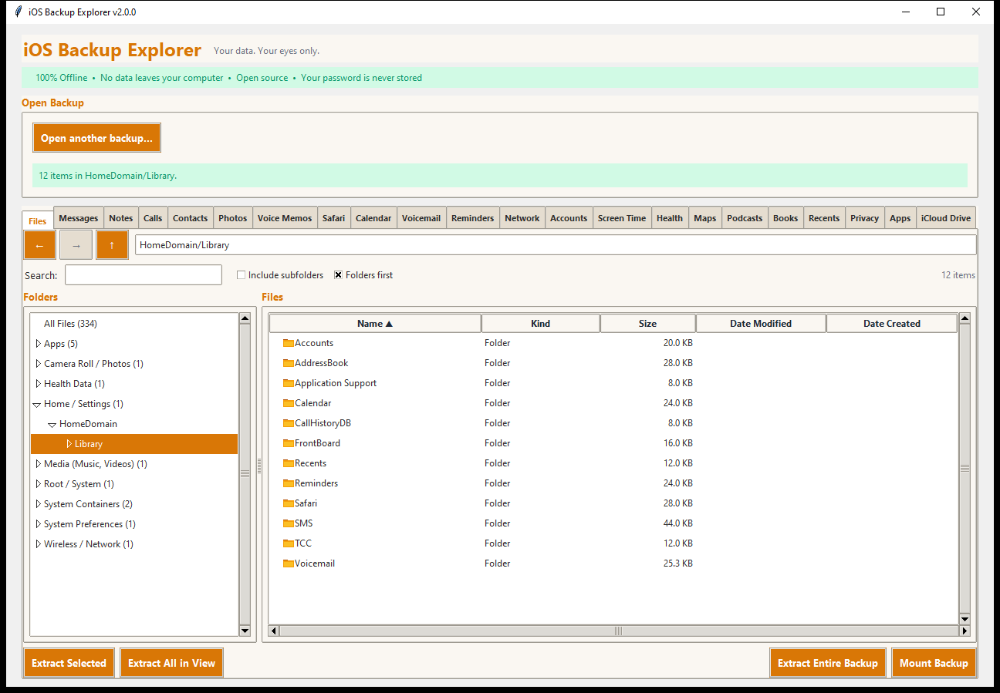

# The file browser

The **Files** tab shows everything in the backup, the way a file manager
shows a disk. It is the right place to find something the app tabs do not
cover, to extract the raw files behind a tab, or to take the whole backup out.

## What you see

- **Folders** (left): the backup's folder tree, with the number of files
  inside each. At the top are friendly *categories* that group the backup's
  domains: **Apps**, **Camera Roll / Photos**, **Health Data**,
  **Home / Settings**, **Media (Music, Videos)**, **Root / System**,
  **System Containers**, **System Preferences** and **Wireless / Network**.
  **All Files** lists every file at once.
- **Files** (right): the contents of the chosen folder, with *Name*, *Kind*,
  *Size*, *Date Modified* and *Date Created* (the creation date is shown where
  iOS recorded one).
- The **location bar** above the list shows where you are and can be typed
  into: type a path such as `HomeDomain/Library/SMS` and press Enter.
- **Domains.** The top-level folders are the backup's *domains* (`HomeDomain`,
  `CameraRollDomain`, `AppDomain-com.apple.mobilesafari`...). See
  [How an iPhone backup is built](HOW_BACKUPS_WORK.md).

## Moving around

| To | Do this |
|---|---|
| Open a folder | Click it on the left, or double-click it in the list |
| Go back / forward | The **←** and **→** buttons, or `Alt+Left` and `Alt+Right` |
| Go up | The **↑** button, or `Backspace` |
| Go to a path | Type it in the location bar and press Enter |
| Search | Click the search box, or press `Ctrl+F` |

## Sorting

Click a column heading to sort by it; click again to reverse the order. You can
sort by **Name**, **Kind**, **Size**, **Date Modified**, **Date Created** or
**Location** (the folder a file is in; useful in a flat list).

- Names sort *naturally*: `IMG_2` comes before `IMG_10`.
- **Folders first** (a tick box) keeps folders above files.
- A folder's size is the total of everything inside it.
- Items whose date is unknown always go last, whichever way you sort.

## Searching

Type in the search box to find files in the current folder **and everything
below it**. Several words must all match (the match is on the whole path, so
`sms attachments` finds files in `.../SMS/Attachments/...`). The search covers
the whole backup index, so it is instant and not limited to what is on screen.

**Include subfolders** lists every file below the current folder in one flat
list, which is handy together with sorting by size or date.

Very long lists are shown a page at a time (10,000 rows per page); use
**Previous page** and **Next page** to move between pages. The status line says
how many items there are.

## Extracting files

Extracting writes the files, **decrypted and exactly as they were on the
phone**, into a folder you choose. The folder structure is
`<domain>/<path>`, for example `HomeDomain/Library/SMS/sms.db`.

| Button or action | What it extracts |
|---|---|
| **Extract Selected** (or right-click, **Extract...**) | The selected files and folders. A folder extracts everything in it |
| **Extract All in View** | Everything in the list now shown, including search results |
| **Extract Entire Backup** | Every file in the backup, taken straight from the backup's index, with no limit on how many files |

Things worth knowing:

- Progress is shown in the status line (`Extracting... 12,000 of 85,000
  files`). One extraction runs at a time.
- Names that Windows cannot store (`? : *` and the like) are changed, and long
  paths (such as the ones notes attachments have) are handled.
- If two files would get the same name in one run, the file ID is added to the
  second so that nothing is overwritten.
- A file that cannot be extracted (for example its data is missing from the
  backup) does not stop the others. At the end a *Done, with problems* box
  lists the first ten problems and says how many more there were.
- Nothing in the backup is ever changed. Unencrypted and extracted backups are
  opened read-only.
- Every app tab also has an **Extract original files...** button that extracts
  just the files behind that tab (for example the Messages database and all
  its attachments) with this same mechanism.

## Right-click menu

Right-click (or Control-click on a Mac) a file or folder for:

- **Open** (folders): go into it
- **Extract...**: extract the selection
- **Copy name** and **Copy path**: put the name, or the full `domain/path`, on
  the clipboard
- **Properties**: name, kind, location, domain, size (and for a folder, how
  many files and how many bytes are inside), dates, and the file ID

## Mounting a backup

Instead of extracting, you can **mount** the open backup as a **read-only drive
or folder** and browse it with your normal file manager and programs. Click
**Mount Backup**; click it again (now **Unmount Backup**) when you are done.

| Platform | What you get | What you need |
|---|---|---|
| **Windows** | A network-style path, `\\ios-backup\<backup name>`, with **no drive letter**. Type it into File Explorer's address bar | [WinFsp](https://winfsp.dev) |
| **macOS** | An empty folder you choose | [macFUSE](https://macfuse.github.io) or [FUSE-T](https://www.fuse-t.org) |
| **Linux** | An empty folder you choose | FUSE (for example `sudo apt install fuse3`) |

On every platform you also need the small Python package (Python 3.9 or
newer): `pip install -r requirements-mount.txt`.

- Files from an **encrypted** backup are decrypted into a private temporary
  folder the first time you open them, and that folder is deleted when you
  unmount.
- Files from an **unencrypted** or **extracted** backup are read straight from
  where they are, with nothing copied.
- While a backup is mounted, programs running as you can read its decrypted
  contents. Unmount when you are done. See [SECURITY.md](../SECURITY.md).
- Mounting adds no network access: the Windows path is served by WinFsp on
  your own computer.
- Mounting was tested on Windows 10 with WinFsp. The macOS and Linux paths
  follow the same design but have not been run on those systems yet; please
  report problems.
