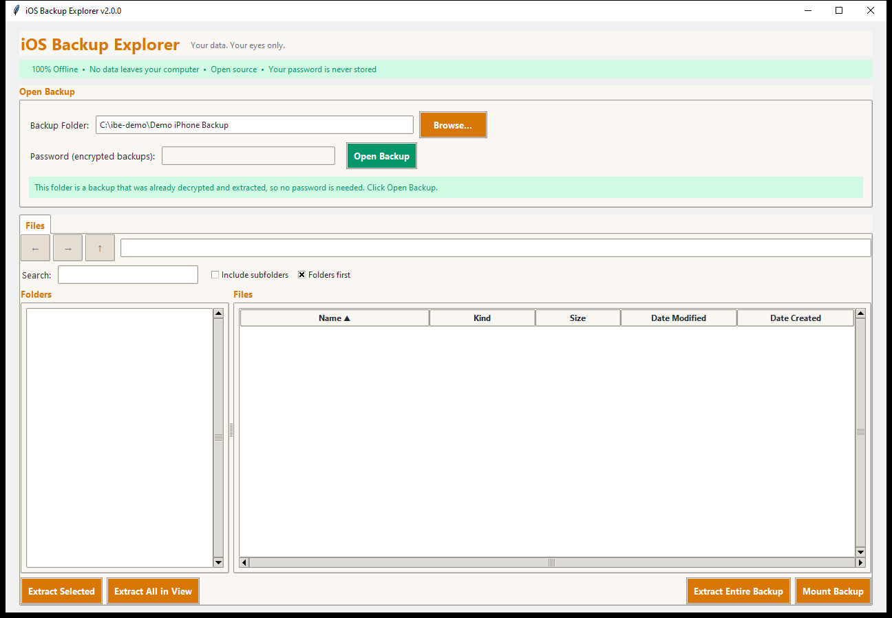
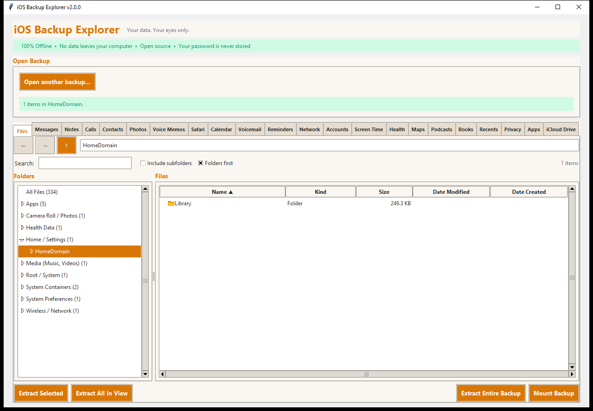

# Getting started

This page takes you from "I have a backup somewhere" to "I am looking at my
messages". It assumes the program is [installed](INSTALL.md).

## 1. Find your backup

iOS Backup Explorer reads **local backups**: the ones iTunes, Finder or the
Apple Devices app make on your computer. It cannot read iCloud backups, which
live on Apple's servers.

When the program starts it looks in the usual places and offers the backup it
finds. If it finds none, or the wrong one, use **Browse...** to choose the
folder yourself.

| Platform | Where backups are kept |
|---|---|
| **Windows** (iTunes installer) | `%APPDATA%\Apple Computer\MobileSync\Backup\` |
| **Windows** (Microsoft Store iTunes, Apple Devices app) | `%USERPROFILE%\Apple\MobileSync\Backup\` |
| **macOS** | `~/Library/Application Support/MobileSync/Backup/` |
| **Linux** | Copy a backup over from a Windows or macOS computer |

Each device has one sub-folder with a long name made of letters and digits
(for example `00008030-001A2B3C4D5E6F78`). **Choose that folder**, the one
that contains `Manifest.plist` and `Manifest.db`, not the `Backup` folder
above it.

### Making an encrypted backup

An encrypted backup contains much more than an unencrypted one (Health data,
saved Wi-Fi networks, and more), so it is the better choice if you want to
explore everything.

1. Connect the iPhone or iPad to your computer.
2. Open **iTunes** (Windows) or **Finder** (macOS), or the **Apple Devices**
   app, and select the device.
3. Tick **Encrypt local backup**.
4. Set a password and **remember it**. It cannot be recovered.
5. Click **Back Up Now**.

## 2. Choose the kind of backup

Type or browse to the folder. The program looks at it and says what it is:

| What the program says | What it means | What to do |
|---|---|---|
| *This backup is encrypted. Enter its password to decrypt it.* | The folder has a `Manifest.plist` marked encrypted | Type the password, click **Decrypt & Open** |
| *This backup is not encrypted, so no password is needed.* | An unencrypted iTunes/Finder backup | Click **Open Backup** |
| *This folder is a backup that was already decrypted and extracted...* | A folder of `HomeDomain`, `CameraRollDomain`... folders, which other tools (and this program's own **Extract Entire Backup**) produce | Click **Open Backup** |
| An explanation of the problem | Not a backup this program can open (for example an old iTunes 9 backup, or the wrong folder) | Follow the hint |

### The password of an encrypted backup

This is the **encryption password you set in iTunes, Finder or the Apple
Devices app**. It is *not* your Apple ID password. The program never stores
it: it is kept in memory while the backup is open and is cleared from the
window as soon as the backup has opened.

The program cannot recover a forgotten password and cannot bypass it; nobody
can. If you forgot it, try your password manager, and on macOS look in Keychain
Access for an item called "iOS Backup". As a last resort Apple lets you
[reset the backup password](https://support.apple.com/en-us/102566) by
resetting the phone's settings, after which you must make a new backup.

## 3. Open it

Click **Decrypt & Open** or **Open Backup**. The status line counts the files
as the backup opens, and then the *file index* is built (the list of every
file with its size and dates). A backup of a few hundred thousand files takes
a few seconds to a minute; after that, browsing, sorting and searching are
instant.

The connection box then folds into a single **Open another backup...** button,
and a row of tabs appears.

## 4. The window

- **Files** is always there. It is a file manager for the whole backup; see
  [The file browser](FILE_BROWSER.md).
- **Every other tab is an app** that the backup has data for: Messages, Notes,
  Calls, Contacts, Photos, Voice Memos, Safari, Calendar, Voicemail,
  Reminders, Network, Accounts, Screen Time, Health, Maps, Podcasts, Books,
  Recents, Privacy, Apps, iCloud Drive. A tab only appears when its data is in
  the backup, so you may see fewer. See [The app tabs](apps/README.md).
- The tabs load when you first click them, not when the backup opens, so
  opening a backup is quick however many tabs there are.
- The status line at the top tells you what the program is doing, and reports
  the result of exports and extractions.
- When there are many tabs and the window is narrow, the tabs get less
  padding and a smaller font so that they all fit. Make the window wider for
  larger tabs.

## 5. Looking around

A good first tour:

1. **Messages**: click a conversation. See
   [Messages](apps/messages.md).
2. **Photos**: a grid of thumbnails with the phone's albums on the left. See
   [Photos and Voice Memos](apps/photos-voice-memos.md).
3. **Health**, **Screen Time**: tables of numbers. See
   [Health](apps/health.md) and [Screen Time](apps/screen-time.md).
4. In any table tab: click a column heading to sort, type in the search box,
   click a row to see its details, and use **Export...** to save what you see.

## 6. Getting your data out

There are two different things you can do, and both are always available:

- **Export** writes what a tab *shows* in a format you can use: a spreadsheet,
  a web page, a calendar file, a GPX route, and so on. See
  [Exporting](EXPORTING.md).
- **Extract original files** copies the *files exactly as the backup has
  them*, decrypted and untouched (for example the raw `sms.db` and every
  attachment), so you always have the raw data too. The file browser can
  extract anything; see [The file browser](FILE_BROWSER.md).

## 7. Closing

Close the window. The program deletes its temporary working copies and forgets
the password. Files you exported or extracted stay where you put them: they
are your data in readable form, so protect or delete them yourself.
