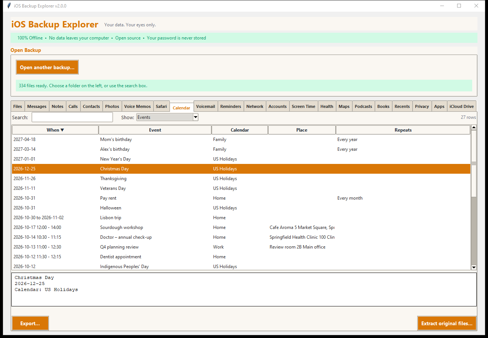

# The app tabs

Next to **Files** the window has one tab for each app the backup holds data
for. A tab appears only when its data is in the backup, and loads when you first
click it.

| Tab | Shows | Page |
|---|---|---|
| **Messages** | iMessage and SMS conversations, with tapbacks, group events, attachments | [Messages](messages.md) |
| **Notes** | Notes with their formatting, checklists, pictures, folders; call recordings | [Notes](notes.md) |
| **Calls** | The call history, FaceTime included | [Calls and Contacts](calls-contacts.md) |
| **Contacts** | The address book | [Calls and Contacts](calls-contacts.md) |
| **Photos** | The camera roll as a thumbnail grid, with albums | [Photos and Voice Memos](photos-voice-memos.md) |
| **Voice Memos** | Recordings | [Photos and Voice Memos](photos-voice-memos.md) |
| **Safari** | History, sites, bookmarks, reading list, open tabs | [Safari and Calendar](safari-calendar.md) |
| **Calendar** | Events and calendars | [Safari and Calendar](safari-calendar.md) |
| **Voicemail** | Voicemails with their transcripts and audio | [Voicemail and Reminders](voicemail-reminders.md) |
| **Reminders** | Reminders and lists from every account | [Voicemail and Reminders](voicemail-reminders.md) |
| **Network** | Wi-Fi networks, Bluetooth devices, data used by apps | [Network and Accounts](network-accounts.md) |
| **Accounts** | The device's details, and the accounts set up on it | [Network and Accounts](network-accounts.md) |
| **Screen Time** | Time per day, week, app and website | [Screen Time](screen-time.md) |
| **Health** | Activity, workouts and routes, body measurements, sleep, Medical ID | [Health](health.md) |
| **Maps** | Favorites, guides, search history | [Maps, Podcasts and Books](maps-podcasts-books.md) |
| **Podcasts** | Shows and episodes | [Maps, Podcasts and Books](maps-podcasts-books.md) |
| **Books** | Library, highlights and notes, collections | [Maps, Podcasts and Books](maps-podcasts-books.md) |
| **Recents** | The people last called, messaged or emailed | [Privacy, Apps, Recents and iCloud Drive](privacy-apps-recents-icloud.md) |
| **Privacy** | App permissions and location access | [Privacy, Apps, Recents and iCloud Drive](privacy-apps-recents-icloud.md) |
| **Apps** | The apps the home screen knew of | [Privacy, Apps, Recents and iCloud Drive](privacy-apps-recents-icloud.md) |
| **iCloud Drive** | Names of the files in iCloud Drive | [Privacy, Apps, Recents and iCloud Drive](privacy-apps-recents-icloud.md) |

Where each tab gets its data, and how well that was checked, is in
[Where the data comes from](../DATA_SOURCES.md).

## Table tabs work the same way

Most of the tabs after Messages and Notes show **tables**, and they all behave
alike:

- **Show:** (top, when a tab has more than one table) chooses the table, for
  example *Events* or *Calendars*. Each table keeps its own sorting.
- **Search** filters the rows as you type (several words must all match; it
  looks at every column and at the details). The counter on the right says
  "12 of 27" when a search is active.
- **Click a column heading** to sort; click again to reverse. Rows with no
  value in that column always go last.
- **Click a row** to see its details in the pane under the table. Select
  several rows (Ctrl-click, Shift-click) and the pane says how many.
- **Double-click** a row does the table's first action where it has one (for
  example *Play* for a voicemail, *Open in browser* for a web address).
- **Export...** saves what you chose: the selected rows, the rows currently
  shown (after a search), or all rows, in a format you pick. See
  [Exporting](../EXPORTING.md).
- **Extract original files...** copies the files behind the tab, exactly as the
  backup holds them, with the normal extraction (it asks for a folder).
- Long tables show the first 2,000 rows and a button for the next ones.
- A line under the table, when there is one, says what to know about the data.

## Dates and times

Dates are shown in **your computer's time zone**, with two exceptions that are
deliberate: an *all-day* event, reminder or Screen Time day keeps its calendar
date whatever the zone, and Screen Time dates days where the phone was.

## Names instead of numbers

Messages, Calls and Voicemail look phone numbers and email addresses up in the
backup's address book, so you see "Alex Rivera" instead of `+15550100101`
(numbers match on their last ten digits, so `+1 (555) 010-0101` and
`5550100101` are the same person).
