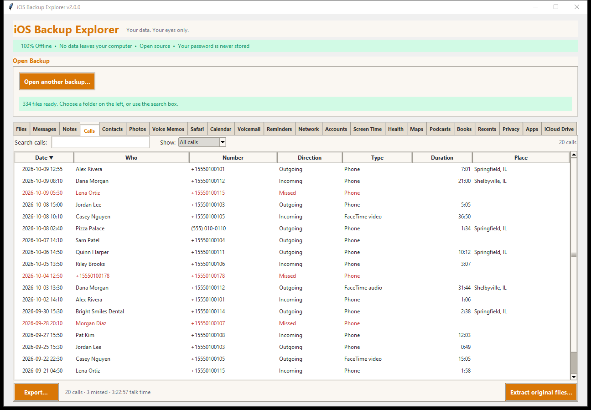
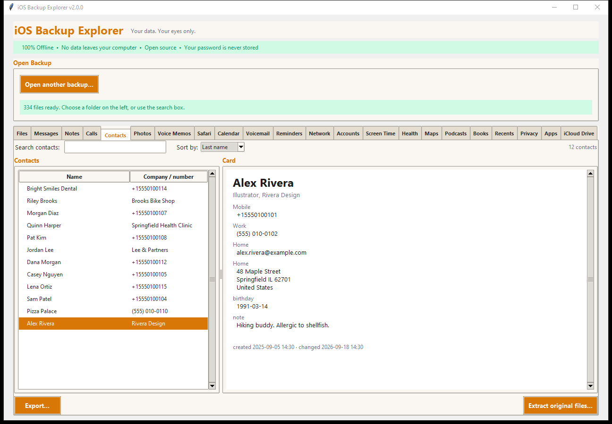

# Calls and Contacts

## Calls

The **Calls** tab is the call history as a table: phone calls and FaceTime
calls, incoming, outgoing and missed.

- **Columns:** *Date*, *Who*, *Number*, *Direction* (incoming, outgoing,
  missed), *Type* (phone, FaceTime video, FaceTime audio), *Duration* and
  *Place* (where the phone says the number is from). Click a heading to sort.
- **Names** come from the backup's address book; a number that is not in it
  stays a number. Missed calls are shown in red.
- **Show:** filters the table: *All calls*, *Missed*, *Incoming*, *Outgoing*,
  *Phone calls* or *FaceTime*.
- **Search calls** looks in names, numbers and places.
- The line under the table counts what you see: calls, how many were missed,
  and the total talk time.
- **Export...** writes the calls you chose (the selected ones, what is shown,
  or all) as a spreadsheet (CSV), a web page, text or JSON.

Calls are read from `HomeDomain/Library/CallHistoryDB/CallHistory.storedata`.
Only calls the phone still had when the backup was made are in it (the phone
keeps a limited history).

## Contacts

The **Contacts** tab is the address book, each person's full card.

- **Contacts** (left): sorted by *Last name* or *First name* (the **Sort by**
  box), with the company or the first number beside each name.
- **Card** (right): everything the entry holds: name and nickname, job title
  and company, every phone number, email address, postal address, web address,
  instant-message account, related person, important date, birthday and note,
  each with its label (Mobile, Home, Work...), and when the entry was created
  and last changed.
- **Search contacts** looks in every field.
- **Contact photos are not included.**

### Exporting

| Format | What you get |
|---|---|
| **vCard (.vcf)** | One file that Apple Contacts, Google Contacts, Outlook and most other address books import. Long lines are folded and special characters escaped as the vCard standard requires |
| Spreadsheet (CSV) | One row for each person |
| Web page | A readable page of cards |
| Text | Plain text |
| JSON | The contacts as data |

Contacts are read from
`HomeDomain/Library/AddressBook/AddressBook.sqlitedb`. The same file gives
Messages, Calls and Voicemail their names.
