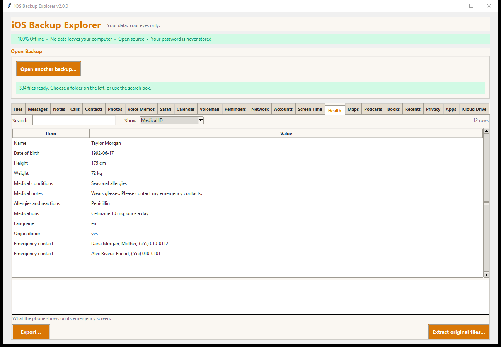
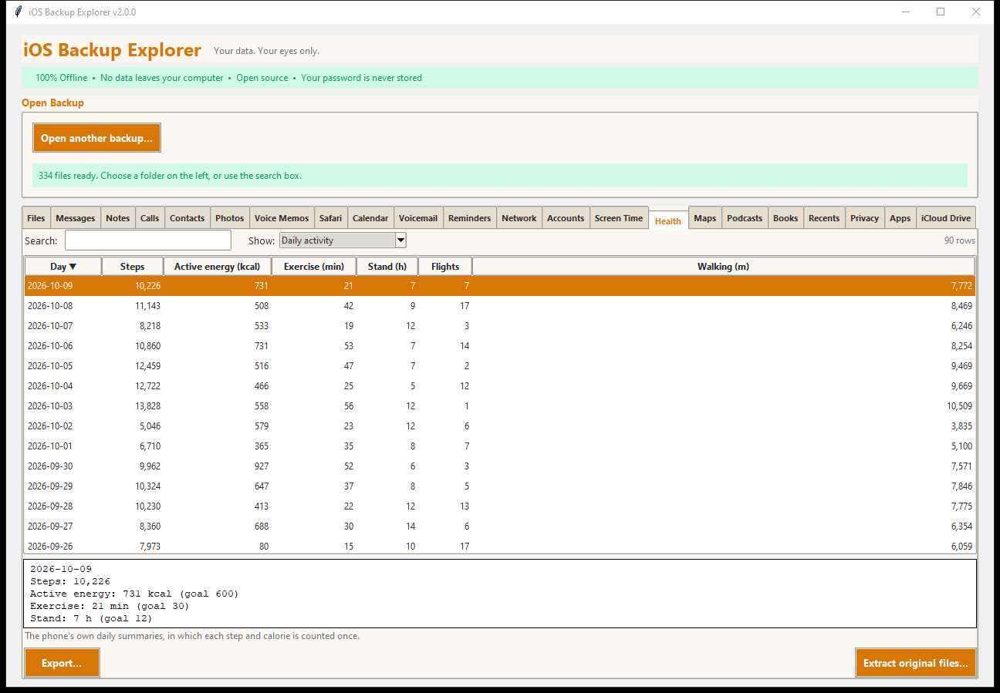
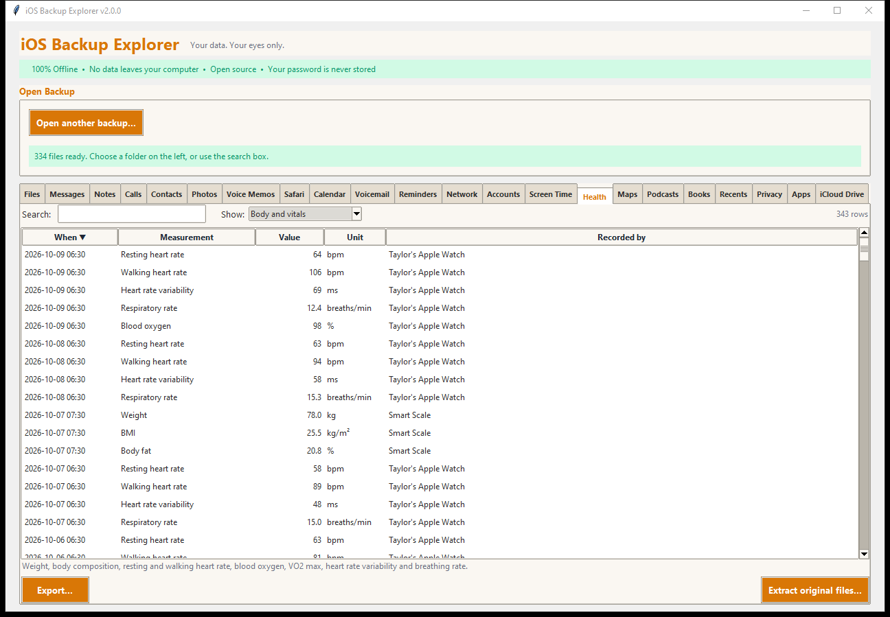

# Health

The **Health** tab shows what the Health app holds: daily activity, workouts
with their routes, body measurements and vitals, sleep, health records and the
Medical ID card.

> Health data is the most sensitive in a backup. It is **only in encrypted
> backups** (Apple leaves it out of unencrypted ones). The Health database can
> be hundreds of megabytes, and the tab copies it when you first click it, so
> give it a moment.

How the data is read, and what is *not* covered yet and why, is explained in
[Health data](../HEALTH.md). Choose a table with **Show:**.

## Medical ID

The card the phone shows on its emergency screen: name, date of birth, height
and weight, medical conditions and notes, allergies and reactions, medications,
blood type, language, organ donation, and the emergency contacts with their
relationship and number. (The demo's data is invented.)

## Daily activity

The phone's own **daily summaries**: *Steps*, *Active energy* (kilocalories),
*Exercise* (minutes), *Stand* (hours), *Flights* climbed and *Walking* distance
in metres. These are the phone's totals, in which each step and calorie is
counted **once** even when the iPhone and a watch both recorded it. The details
pane shows the day's goals (move, exercise, stand).

## Workouts

Every workout: *When*, the *Workout* (Running, Walking, Cycling, Hiking, Yoga,
Elliptical, Functional strength training, Cooldown...), *Duration*, *Distance*,
*Active energy*, *Heart rate* (average) and whether it has a *Route*. The
details add the highest heart rate and who recorded it.

**Export routes:** choose **Routes (GPX, for mapping programs)** in *Export...*
to write one GPX file with a track for each workout that has a route. GPX opens
in mapping programs and services (the points carry latitude, longitude,
altitude and time).

## Body and vitals

Weight, body mass index, body fat, lean body mass, height, resting heart rate,
walking heart rate, blood oxygen, VO2 max, heart rate variability and breathing
rate, each with its value in the usual unit and the app or device that recorded
it (an Apple Watch, a smart scale). Only these kinds are shown because their
units were checked; see [Health data](../HEALTH.md).

## Sleep

Every sleep stage the phone recorded: *From*, *To*, *Length*, the *Stage* (In
bed, Asleep, Awake, and Core, Deep and REM where the phone distinguishes them)
and who recorded it. Stages are listed, not summed per night; the reason is in
[Health data](../HEALTH.md#what-is-not-covered-yet).

## Health records

The names of what healthcare providers sent to the Health app (lab results,
immunizations, medications, conditions): the date, the kind and the name. The
contents of the records are not read.

## Data types

A count of **everything** the database holds, by kind of data: how many samples,
and the first and last date. A kind the backup does not name appears as
"Type N". This table is the quickest way to see what the Health database
contains and how far back it goes.

## Exporting and extracting

Each table exports as a spreadsheet, web page, text or JSON; *Workouts* also as
GPX. **Extract original files...** copies the Health databases and the Medical
ID file exactly as the backup holds them, so the raw data is always yours to
analyse with other tools.
