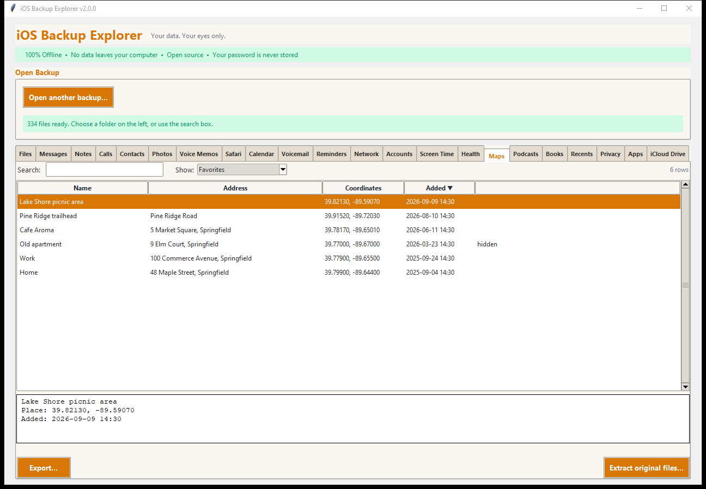
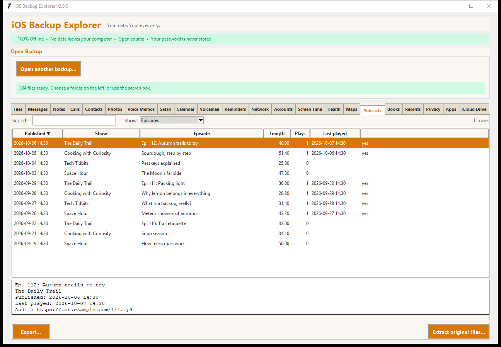
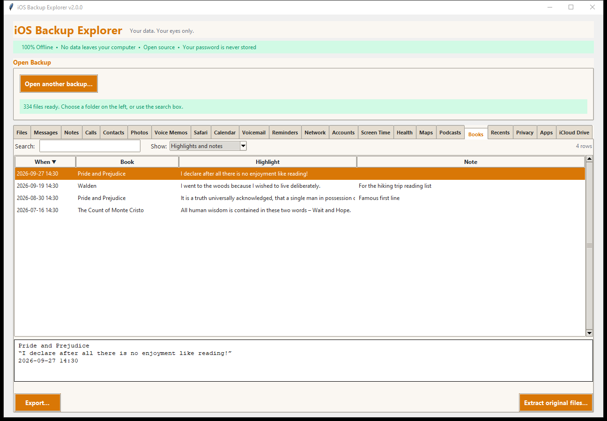

# Maps, Podcasts and Books

> **How well these three are checked.** They were written from the layout of
> the apps' databases. The backup they were written against held the
> databases but no places, episodes or books, so they are tested on
> *generated* databases only, not against real data. If one does not show what
> you expect, please [report it](../../CONTRIBUTING.md#reporting-a-problem)
> (without sending your data). See
> [Where the data comes from](../DATA_SOURCES.md).

## Maps

Tables, chosen with **Show:**:

| Table | What it holds |
|---|---|
| **Favorites** | Your saved places: name, address, coordinates, when added, hidden or not |
| **Places in guides** | The places in each guide (collection) |
| **Guides** | Each guide with how many places it holds |
| **History** | What you searched for and the places you looked at, newest first |

- **Export places as GPX:** choose **Places (GPX, for mapping programs)** to
  write the places that have coordinates as waypoints.
- Places you saved from the map (rather than named yourself) keep their name
  and address inside a binary record that is not read, so they show by
  coordinates only.

Source: `AppDomainGroup-group.com.apple.Maps/Maps/MapsSync_0.0.1`.

## Podcasts

- **Shows:** title, author, how many episodes, how many you played, when last,
  and whether you follow it.
- **Episodes:** published date, show, title, length, play count, last played,
  whether it is downloaded; the details add where you stopped and the audio's
  web address.

Source: `.../Documents/MTLibrary.sqlite` in the Podcasts app group.

## Books

| Table | What it holds |
|---|---|
| **Books** | The library with author, kind (book or audiobook), how far you read, when last opened and bought. Purchases the store lists that are not in the library are added |
| **Highlights and notes** | What you highlighted or wrote while reading, with the book and the date |
| **Collections** | Your collections (Want to Read, ...) |

Source: `AppDomainGroup-group.com.apple.iBooks/Documents/` (`BKLibrary`,
`AEAnnotation`, `BKJaliscoServerSource`, `BCCloudCollections`). The books'
files themselves are not shown.

## Exporting

Every table exports as a spreadsheet, web page, text or JSON; Maps tables also
as GPX. **Extract original files...** copies the databases.
