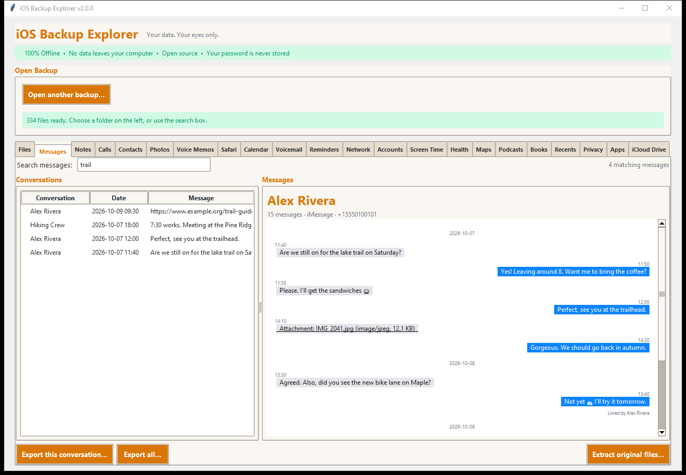

# Messages

The **Messages** tab shows your iMessage and SMS conversations the way the
Messages app does.

## What you see

- **Conversations** (left), newest first, with the date of the last message and
  how many there are. Names come from the backup's address book; a number that
  is not in it is shown as the number (like `55501` above, a verification-code
  sender). An iMessage chat and an SMS chat with the *same number* are shown as
  **one** conversation, like on the phone.
- **The chat** (right). Your messages are on the right in blue (green for SMS),
  theirs on the left in grey, each with the time and, in a group, who sent
  it. Day headings separate the days.
- **Tapbacks** (loved, liked, laughed at...) appear under the message they are
  about ("Loved by Alex Rivera"). A tapback that was later removed is not
  shown; one whose message is not in the backup is listed on its own.
- **Group events** appear as centred notes: someone named the conversation,
  added or removed someone, left it, or shared their location.
- **Attachments** (pictures, files) are listed in the message; **click one to
  save it** (the program asks where). Large conversations load a page at a time.

## Searching

Type in **Search messages** to look inside **every conversation**. The results
list shows the matches; click one to jump to it in its conversation, with the
match highlighted.

The search also finds text that iOS 16 and later keep only in an archived form
(the `attributedBody` field) rather than as plain text, which is why some tools
miss newer messages.

## Exporting

**Export this conversation...** and **Export all...** write:

| Format | What you get |
|---|---|
| Text | One text file for each conversation |
| Web page | A page you can open in any browser, with the attachments beside it, no internet needed and no scripts in it |
| Spreadsheet (CSV) | One row for each message |
| JSON | The messages as data for programs |

**Extract original files...** copies the Messages database *with its recent-
changes file* (`sms.db`, `sms.db-wal`, `sms.db-shm`) and all the attachments,
exactly as the backup holds them.

## Good to know

- **Recent messages.** The newest messages on a phone are often not yet in the
  main database but in a small companion "write-ahead log" file. The program
  copies both together, so nothing recent is lost.
- **Deleted messages.** Messages deleted on the phone before the backup was
  made are not in the backup. Messages in *Recently Deleted* may be.
- **Missing text.** The layouts change between iOS versions. If text looks
  wrong or is missing, please [report it](../../CONTRIBUTING.md#reporting-a-problem)
  without sending your data.
- **Source.** `HomeDomain/Library/SMS/sms.db`, attachments in
  `MediaDomain/Library/SMS/Attachments/`, names from
  `HomeDomain/Library/AddressBook/AddressBook.sqlitedb`.
