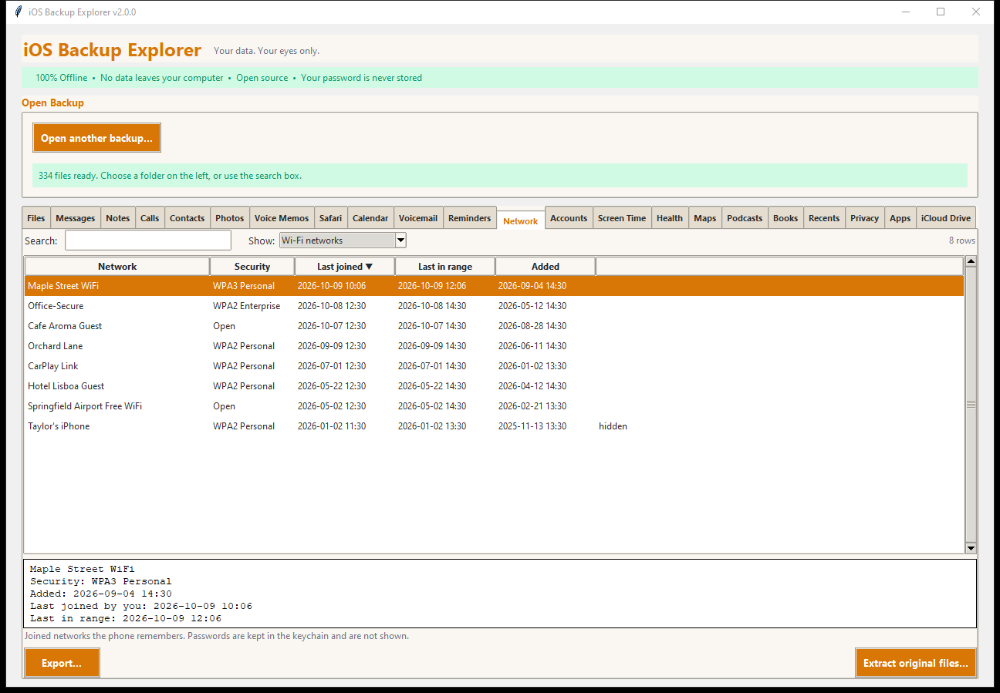
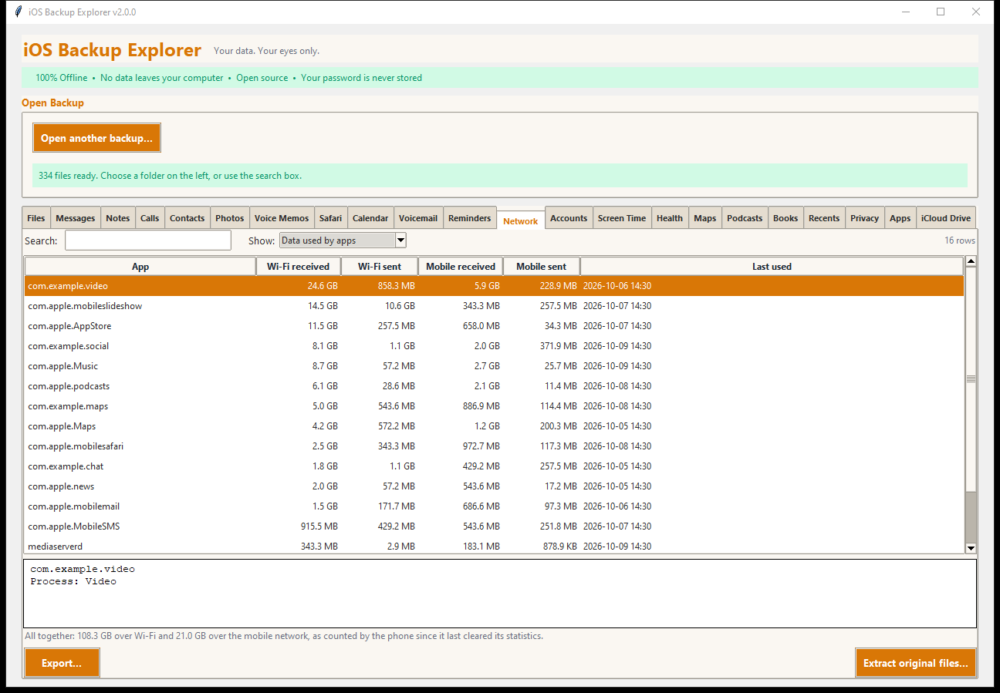
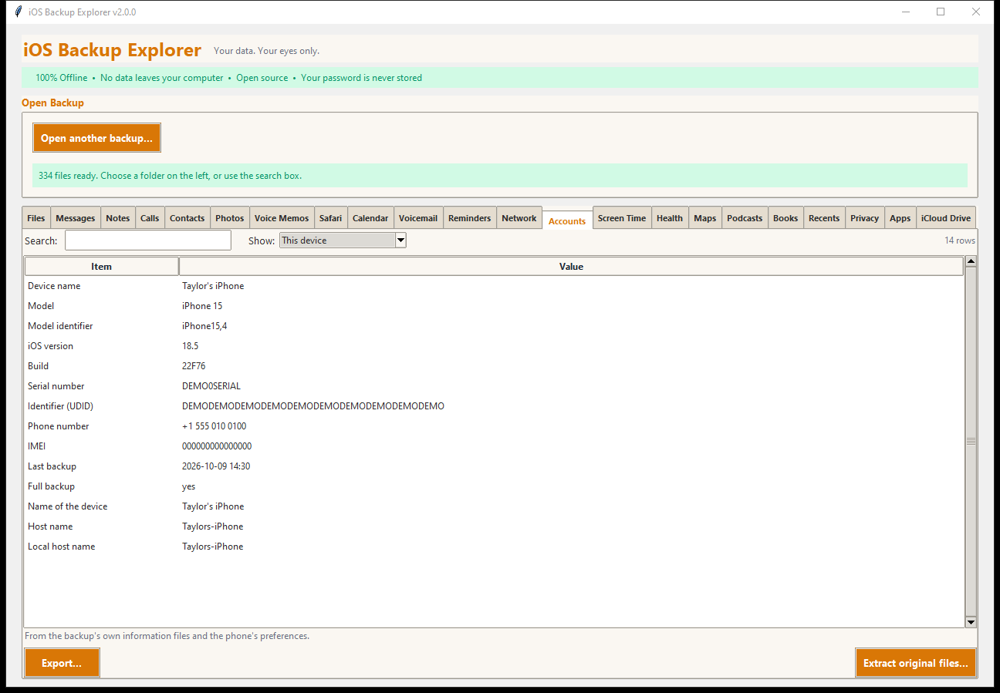
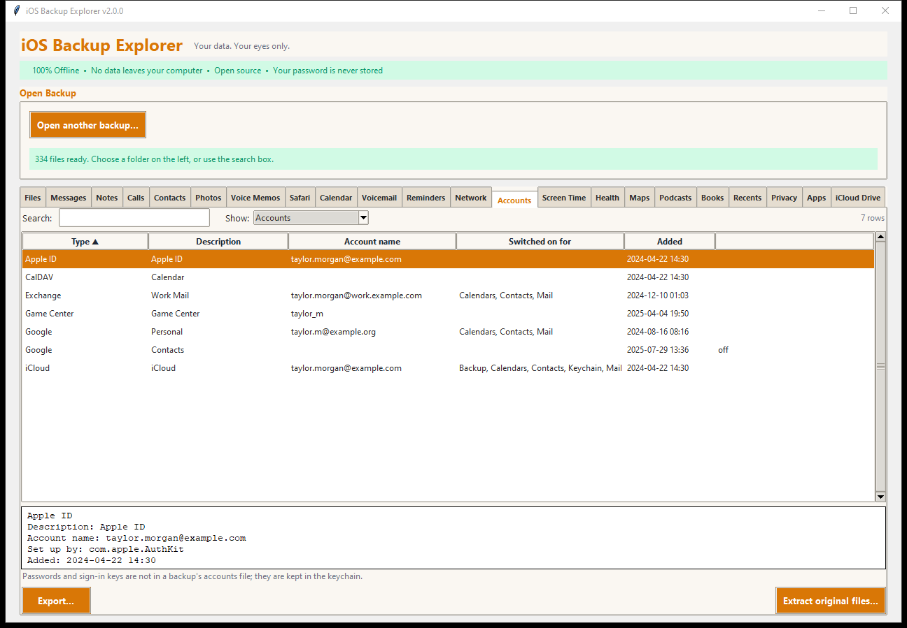

# Network and Accounts

## Network

The **Network** tab shows what the phone remembers about networks, in three
tables.

### Wi-Fi networks

Every network the phone has joined: *Network*, *Security*, *Last joined*,
*Last in range*, *Added*, and a mark for hidden networks. The details pane
adds the router's address, the channel, how many access points the phone
knows for it, whether CarPlay uses it, and **the last place it was seen at**
(coordinates; the phone records where it was when it saw the network).

Wi-Fi **passwords are not shown**: they are kept in the keychain, not in this
file.

### Bluetooth devices

The classic devices (headphones, speakers, a car) with when each was last
seen, the low-energy devices that are paired (a watch), and the many low-energy
devices that were only **seen nearby** (a backup can list hundreds or
thousands of strangers' beacons and gadgets). *Kind* tells them apart.

### Data used by apps

For each app and system process: Wi-Fi received and sent, mobile data
received and sent, and when it was last used, largest total first. The line
under the table adds everything up. The figures are what the phone has counted
since it last cleared its statistics, not a bill.

Sources: `SystemPreferencesDomain/com.apple.wifi.known-networks.plist` (and the
older `.../SystemConfiguration/com.apple.wifi.plist`), the Bluetooth databases
and `MobileBluetooth.devices.plist` in the Bluetooth shared container, and
`WirelessDomain/Library/Databases/DataUsage.sqlite`.

## Accounts

The **Accounts** tab has two tables.

### This device

The device's name, and, when the backup folder has its information files (a
real iTunes/Finder/Apple Devices backup does; a folder extracted by another
tool does not), the model, iOS version and build, serial number, identifier,
phone number, IMEI, when the backup was made, whether it is encrypted and
whether a passcode was set. The phone's own name for itself comes from its
preferences.

### Accounts

The accounts the phone knows (iCloud, Apple ID, Google, Exchange, CalDAV, Game
Center and the services that sign in behind them): *Type*, *Description*,
*Account name*, *Switched on for* (Mail, Contacts, Calendars...), when it was
*Added*, and a mark for accounts that are switched off. The details add
which part of the system set it up.

**Passwords and sign-in keys are not in a backup's accounts file;** they are
in the keychain.

Source: `HomeDomain/Library/Accounts/Accounts3.sqlite`,
`SystemPreferencesDomain/SystemConfiguration/preferences.plist`, and
`Info.plist`, `Manifest.plist` and `Status.plist` in the backup folder.
