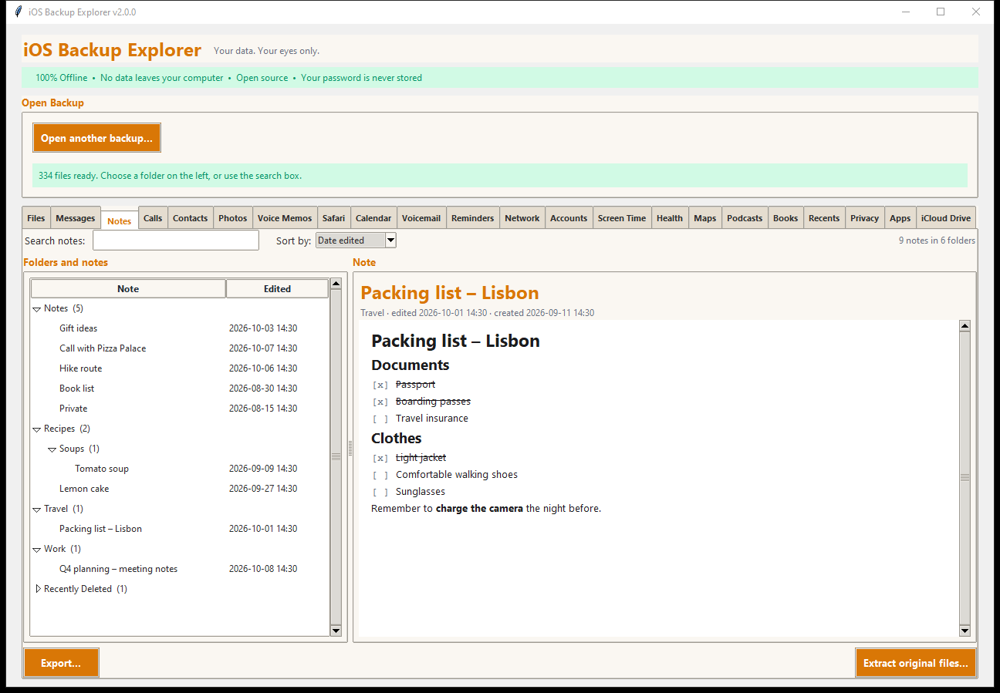

# Notes

The **Notes** tab shows your notes as they look on the phone: formatting,
checklists, pictures, folders and all.

## What you see

- **Folders and notes** (left): the folders with the number of notes in each,
  sub-folders inside them (here *Soups* inside *Recipes*), and *Recently
  Deleted*. Pinned notes come first. **Sort by** *Date edited*, *Date created*
  or *Title*.
- **The note** (right): the title, the folder, when it was edited and created,
  and the note itself.

### Formatting that is shown

Title and headings; bullet, dashed, numbered and **checklist** items (ticked
items are struck through); **bold**, *italic*, underlined and struck-through
text; links; indentation; and the pictures in the note. The look is a close
copy, not an exact one.

### Attachments

- **Pictures** are shown in the note (HEIC pictures need the optional
  `pillow-heif`; see [Installation](../INSTALL.md)).
- **Voice recordings and other attachments** are listed in the note; **click
  one** to open it with your usual program or to save it.
- **Hashtags and link previews** are shown as the text they stand for.

### Call recordings (iOS 18)

A recorded call appears in its note with its title, its length and the
**words Notes wrote down** (the transcript), shown under the recording. In the
backup, a call recording is a movie file (`.mov`) with a *separate track for
each side of the call*. When you open, save, export or extract one you choose:

| Choice | What you get |
|---|---|
| **Mixed audio** | One `.m4a` with both sides together. Made with [ffmpeg](https://ffmpeg.org) from the tracks, so ffmpeg must be installed |
| **Original** | The `.mov` as it is, with the separate tracks |
| **Both** | Both of the above |

The original is never changed.

### Notes that cannot be shown

- **Locked notes** (protected with a password in Notes) are listed, but their
  text is encrypted in the backup and cannot be shown.
- A note whose stored text cannot be read is still listed, with a message
  saying so and the short preview iOS keeps, so you know it exists.

## Searching

**Search notes** looks in titles and in the text, and also in hashtags and link
titles. The results appear in the list on the left.

## Exporting

**Export...** exports one note, a whole folder (with its sub-folders) or
everything. The output follows your Notes folders:

| Format | Notes |
|---|---|
| Text | Plain text |
| Markdown | Headings, lists, checklists (`- [x]`), bold and italic kept |
| Web page | With the pictures beside it; HEIC pictures are converted to JPEG when Pillow and pillow-heif are installed. No scripts, and links are only clickable if they are web, mail or phone links |
| PDF | Needs the optional `fpdf2` |
| JSON | Everything about each note, as data |
| Spreadsheet (CSV) | One row for each note |

**Extract original files...** copies the Notes database (with its recent-
changes files) and the media, exactly as the backup holds them.

## Source

`AppDomainGroup-group.com.apple.notes/NoteStore.sqlite` and its `Accounts/`
media folders. The older layout (`HomeDomain/Library/Notes/notes.sqlite`) is not read
(see [Where the data comes from](../DATA_SOURCES.md)).
