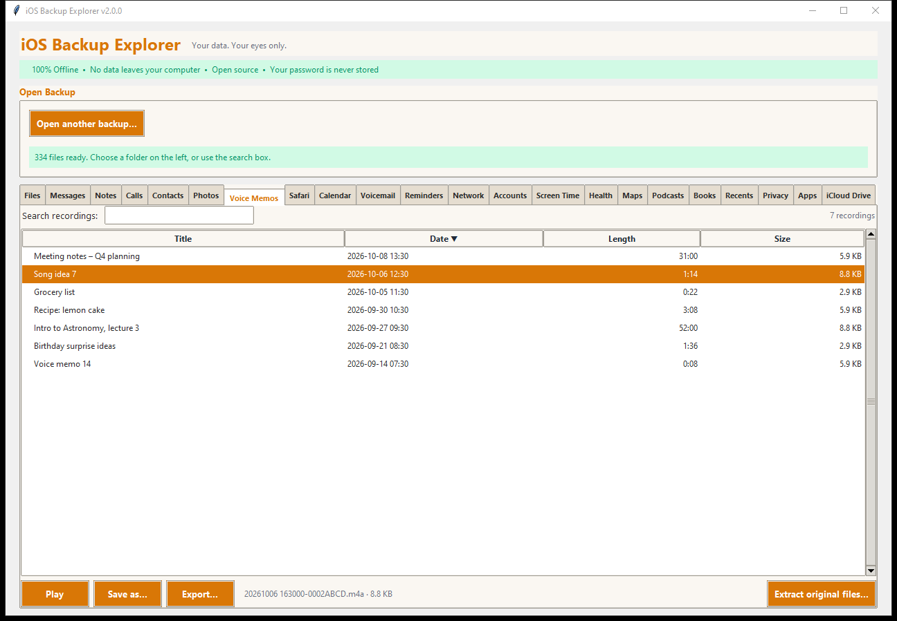

# Photos and Voice Memos

## Photos

The **Photos** tab shows the camera roll as a **grid of thumbnails**, with the
phone's albums on the left.

- **Albums** (left), as the phone's own library records them: *All items*,
  *Photos*, *Videos*, *Favorites*, *Hidden*, *Recently Deleted*, and your own
  albums under *My albums*, each with a count. Click one to see its items.
  Without the library database the **DCIM** folders are listed instead.
- **Thumbnails** are made only for what is on screen, so a library of tens of
  thousands of pictures opens at once. A heart marks favourites; videos show a
  play symbol and their length. Scroll to load more.
- **Sort by** *Date taken* (newest or oldest first), *Name*, *Size* or *Type*.
  **Search** looks in names, folders, albums and places.
- **Selecting:** click one, Ctrl-click to add or remove, Shift-click for a range.
  **Double-click** (or **Open**) opens a picture in your usual viewer.
- **Save as...** saves one item under a name you choose.

Thumbnails and previews need the optional **Pillow** package, and HEIC
pictures (what iPhones take by default) also need **pillow-heif**; without
them tiles are grey but every other function works. See
[Installation](../INSTALL.md).

### Exporting

| Format | What you get |
|---|---|
| **Original files** | Copies named by what they are, with the date taken set as the file's date |
| **Pictures as JPEG** | HEIC and other formats converted so every program can open them; videos are copied as they are |
| **Web gallery** | A page with JPEG pictures and thumbnails, openable in any browser |
| **A list (CSV)** | The files with their dates, sizes and places; nothing is copied |

**Extract original files...** uses the normal extraction (with progress) and
keeps the backup's own folders.

### What is not here

- Photos that live only in iCloud ("Optimize iPhone Storage") are not on the
  phone and so not in the backup.

Source: `CameraRollDomain/Media/DCIM/` and
`CameraRollDomain/Media/PhotoData/Photos.sqlite`.

## Voice Memos

The **Voice Memos** tab lists the recordings.

- **Columns:** *Title*, *Date*, *Length*, *Size*. Click a heading to sort;
  **Search recordings** looks in titles.
- **Play** opens the selected recording in the program your computer plays
  audio with. **Save as...** saves it.
- The audio is **never converted**: it is exactly what the phone recorded
  (usually `.m4a`, which nearly every player opens).

### Exporting

| Format | What you get |
|---|---|
| Audio files | Named by date and title |
| Web page | A page with a player for each recording |
| A list (CSV) | Title, date, length, size and file name; nothing is copied |

Source: the Voice Memos app group's `Recordings/` folder and
`CloudRecordings.db` (older phones: `MediaDomain/Media/Recordings`). A
recording without a database entry is still listed, by its file name.
