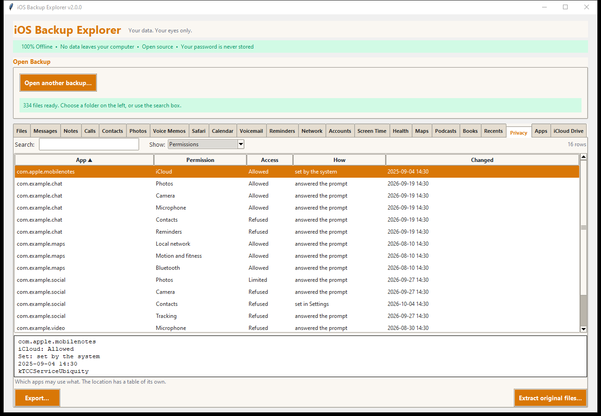
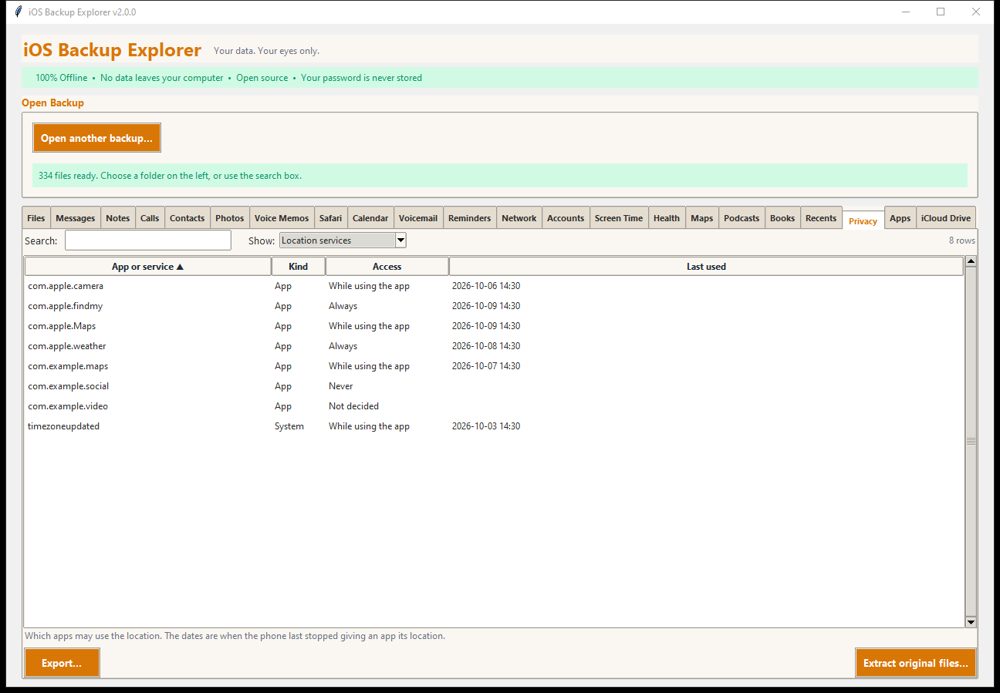
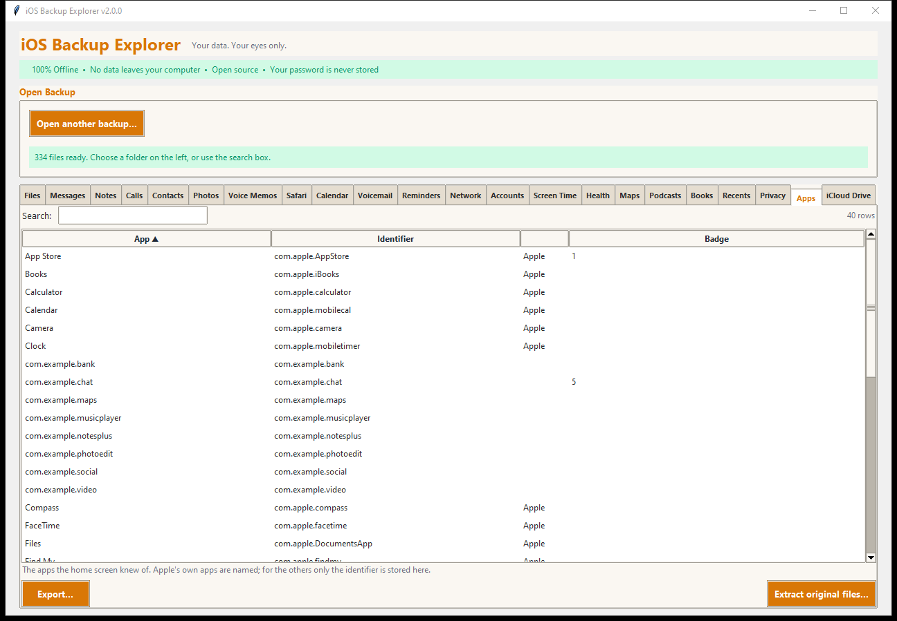
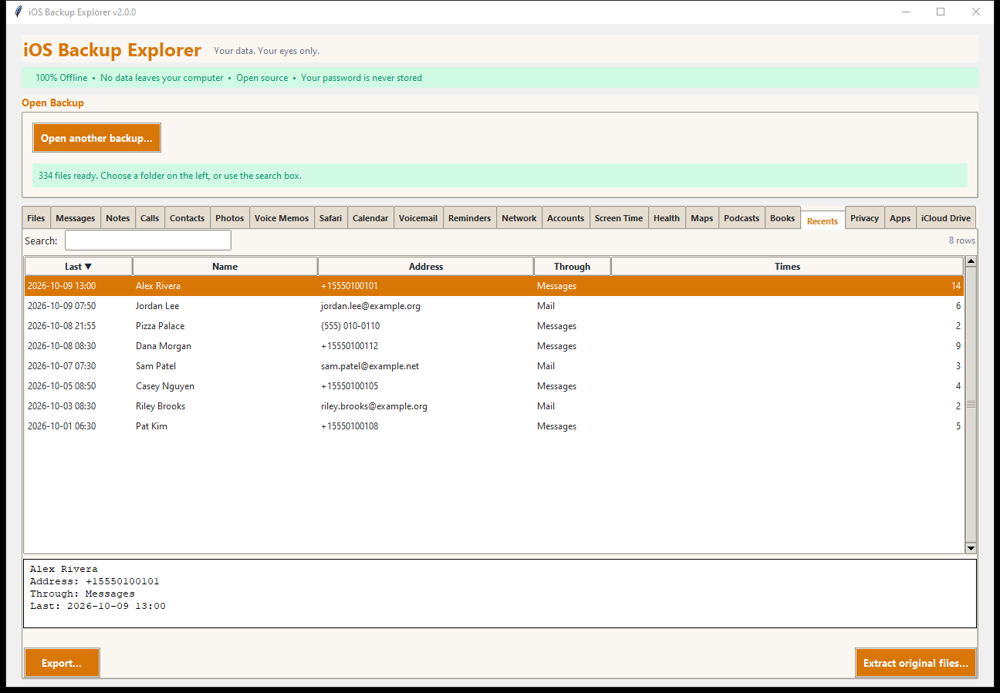
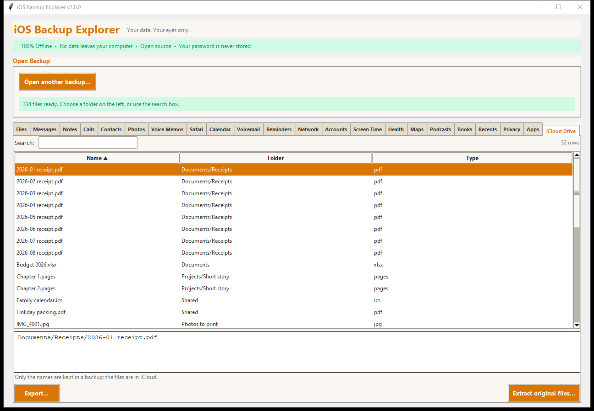

# Privacy, Apps, Recents and iCloud Drive

Four small tabs that show what the phone knows about itself and your habits.

## Privacy

**Permissions.** What apps were allowed or refused: *App*, *Permission* (Photos,
Camera, Microphone, Contacts, Local network, Tracking, Bluetooth, Motion and
fitness, iCloud...), *Access* (**Allowed**, **Refused**, **Limited**, *Not
decided*), *How* it was set (you answered a prompt, you set it in Settings, the
system set it, a management profile, the app's entitlement...) and *Changed*
(when). A permission whose service has no friendly name is shown with its
identifier made readable.

**Location services.** Each app and system part that asked for the location, and
whether it may have it: **Always**, **While using the app**, **Never**,
*Not decided*, *Restricted*. *Last used* is when the phone last stopped giving
the app its location. System parts (the phone's own daemons) are marked
*System*.

Sources: `HomeDomain/Library/TCC/TCC.db` and
`RootDomain/Library/Caches/locationd/clients.plist`.

## Apps

The apps the home screen had: name, identifier, whether it is Apple's, and the
**badge** (the number or mark on its icon, such as unread mail). Apple's own
apps are named; for the others the backup holds only the identifier, since a
name would need the App Store.

Source: `HomeDomain/Library/FrontBoard/applicationState.db`.

## Recents

The phone's list of recent contacts: *Last* (when), *Name*, *Address*, *Through*
(Messages, Mail, Phone...) and *Times*. The details note when a person has
more than one address. This is the list the phone offers when you start
addressing a message or email.

Source: `HomeDomain/Library/Recents/Recents`.

## iCloud Drive

The **names** (and folders) of the files that were in iCloud Drive, from the
file provider's own backup manifest. A backup holds only the names: the files
themselves are in iCloud (a phone that has not downloaded a file keeps just a
small placeholder).

Source: `HomeDomain/Library/Application Support/FileProvider/backup/
backup_manifest.db`.

## Exporting

Every table exports as a spreadsheet, web page, text or JSON, and
**Extract original files...** copies the databases and lists.
