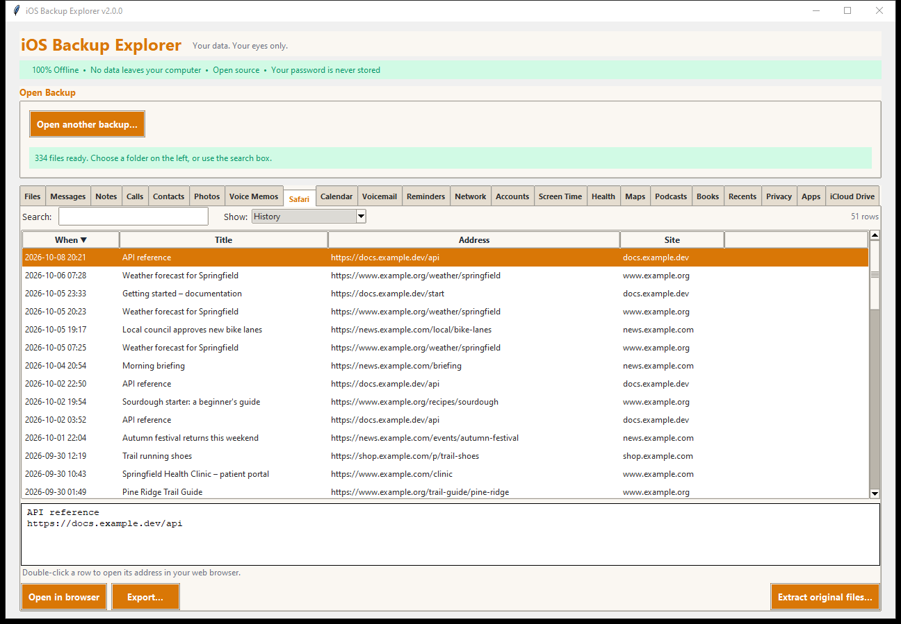
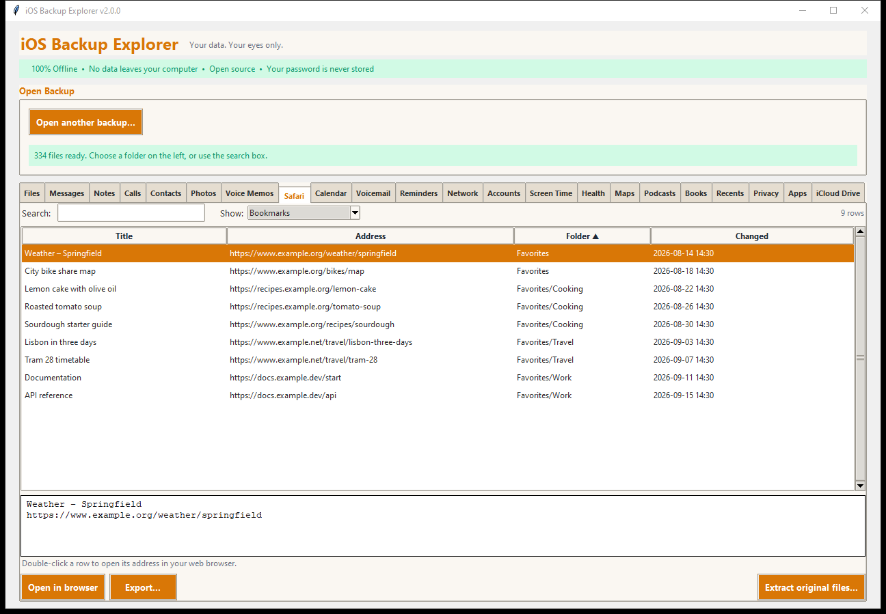
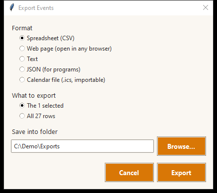

# Safari and Calendar

## Safari

The **Safari** tab has five tables; choose one with **Show:**.

| Table | What it holds |
|---|---|
| **History** | Every page visit, newest first: when, the page title, its address, the site, and a mark for pages that failed to load |
| **Sites visited** | One row for each site: how many visits, how many different pages, and when you were last there |
| **Bookmarks** | Your bookmarks with the folder each is in (*Favorites*, and your own folders) |
| **Reading list** | Pages saved to read later |
| **Open tabs** | The tabs that were open, by window (private ones are listed under *Private tabs*) |

- **Double-click a row** (or **Open in browser**) to open its address in your
  web browser. Only `http` and `https` addresses are opened from here; anything
  else (a `file:` or `javascript:` address, for example) is refused, because
  something inside a backup could be hostile.
- **Export** any table as a spreadsheet, web page, text or JSON. The
  **Bookmarks** table can also be exported as a **bookmarks file** that Chrome,
  Firefox, Edge and Safari import (the common Netscape bookmarks format), with
  your folders.
- **Extract original files...** copies `History.db`, `Bookmarks.db` and
  `SafariTabs.db` with their recent-changes files.

Source: `HomeDomain/Library/Safari/`.

## Calendar

The **Calendar** tab lists the events and the calendars.

- **Events:** *When*, *Event*, *Calendar*, *Place* and *Repeats* ("Every
  year", "Every 2 weeks"). The details pane adds the notes, the address of a
  place and the web address of an event.
- **Calendars:** each calendar and account with how many events it holds and
  the earliest and latest.
- **All-day events keep their date** whatever your computer's time zone: an
  event on 25 December shows 25 December. A multi-day event shows as
  `2026-10-30 to 2026-11-02`. A birthday that has no year says "(year not
  set)". An event that goes past midnight names both days.
- Reminders are not here; they have their own tab.

### Exporting

Besides a spreadsheet, web page, text and JSON, events export as an
**iCalendar file (.ics)**:

The `.ics` file imports into Google Calendar, Outlook, Apple Calendar and
others. Timed events are written in UTC, all-day events as dates, and repeats
(daily, weekly, monthly, yearly, with intervals, counts and end dates) are
kept as repeat rules. Text is escaped and lines are folded as the standard
requires.

Source: `HomeDomain/Library/Calendar/Calendar.sqlitedb`.
