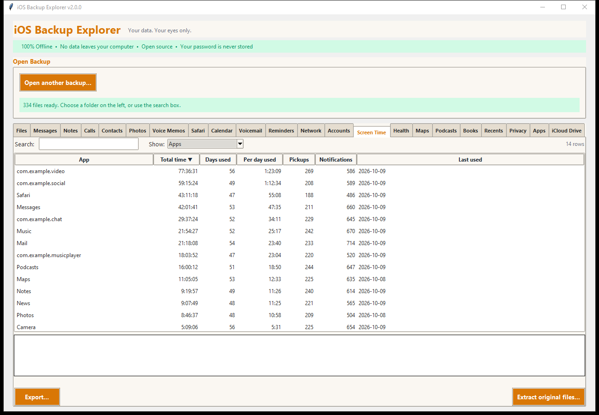

# Screen Time

The **Screen Time** tab shows how the phone was used: time per day and week,
per app and per website, how often it was picked up, and how many
notifications arrived.

## The tables

| Table | What it holds |
|---|---|
| **Days** | One row for each day: *Screen time*, *Pickups*, *Notifications*, how many *Apps* were used, and the *Most used app* with its time. Click a day for the details |
| **Weeks** | One row for each week: total screen time, the average per day, pickups |
| **Apps** | Each app over all the days: total time, days used, time per day used, pickups, notifications, last used |
| **Websites** | Each web domain Screen Time recorded: total time and days |
| **Recent hours** | Hour by hour for the most recent 31 days: screen time, pickups, the most used app. Only hours with some use have a row |

## Good to know

- **Days are dated where the phone was.** A day starts at local midnight; the
  program works out the zone from when the days begin, so a day that starts at
  05:00 UTC is the date in a zone five hours behind UTC. A week's total equals
  the sum of its seven days.
- **Names of apps.** Apple's own apps are named ("Safari", "Messages"); other
  apps are shown by their **identifier** (`com.example.chat`) because the
  backup holds no store names.
- **Pickups** count each time the phone was picked up (the pickups credited to
  an app plus those with no app activity).
- **Several devices.** If Screen Time is shared across devices, each device's
  rows are listed and a *Device* column tells them apart.
- **Hours.** Reading thousands of small hour files would be slow, so only the
  most recent 31 days are read by the hour. Days and weeks are read in full.
- The hours of a day do not necessarily add up to exactly that day's total;
  the phone rounds them separately.

## Exporting

Every table exports as a spreadsheet, web page, text or JSON.
**Extract original files...** copies the Screen Time files (one small
property list for each day, week and hour).

Source: `SysSharedContainerDomain-systemgroup.com.apple.DeviceActivity/
Library/com.apple.DeviceActivity/Cloud/.../{Daily,Weekly,Hourly}/
ActivitySegments/<start>.plist`.
