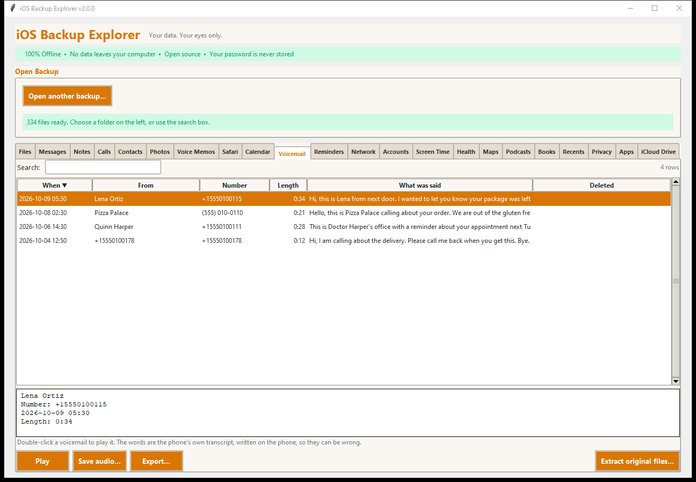
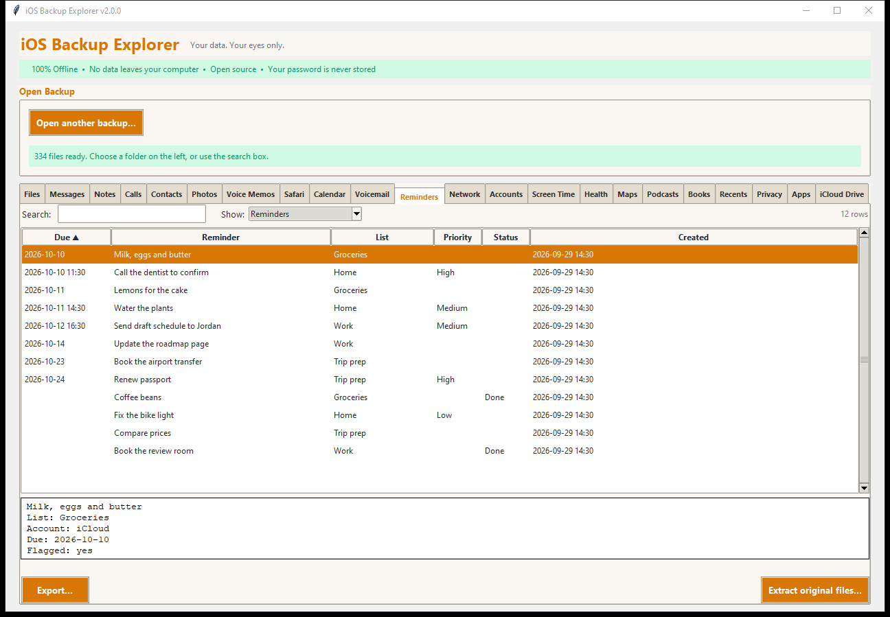

# Voicemail and Reminders

## Voicemail

The **Voicemail** tab lists each voicemail with who it was from, when, how
long it was, and **the words the phone wrote down**.

- **From** is a name when the caller's number is in your contacts, else the
  number. **Length**, **Deleted** (voicemails you deleted that the backup still
  holds are marked with the date).
- **What was said** is the phone's own transcript, written on the phone, so it
  can be wrong. The full text is in the details pane.
- **Play** (or double-click) opens the recording in your audio player;
  **Save audio...** saves it. The recordings are `.amr` files, which most
  players open (VLC does).
- **Search** looks in names, numbers and the words.

### Exporting

Besides a spreadsheet, web page, text and JSON, **Audio files with the words as
text** copies each recording, named by date and caller (`2026-10-09 053000 -
Lena Ortiz.amr`), with the transcript beside it as a `.txt` file. A voicemail
whose audio is not in the backup is skipped and reported.

Source: `HomeDomain/Library/Voicemail/` (`voicemail.db`, `<number>.amr`,
`<number>.transcript`). Note that this database counts time from 1970, unlike
most iOS databases.

## Reminders

The **Reminders** tab shows every reminder of **every account** (iCloud, on
the phone, others), and the lists.

- **Reminders:** *Due* (all-day reminders show just the date), *Reminder*,
  *List*, *Priority* (High, Medium, Low), *Status* (**Done**, or **Deleted** for
  ones in the backup that were deleted) and *Created*. Sub-tasks name their
  parent in the details; flagged items are marked there too.
- **Lists:** each list with its account, how many reminders it holds and how
  many are not done.
- Export as a **to-do file (.ics)** that task programs import (due dates,
  priority, notes, the list as a category, completed status), or as a
  spreadsheet, web page, text or JSON. Deleted reminders are left out of the
  `.ics` file.

Source: `HomeDomain/Library/Reminders/Container_v1/Stores/Data-*.sqlite`, one
database for each account; all of them are read. Repeating reminders are not
expanded (their repeat rule is not decoded).
